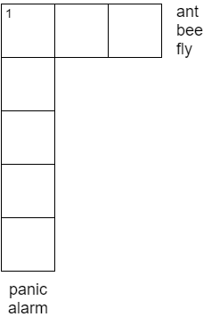

Google defines a crossword as a grid of squares with blanks into which words crossing vertically and horizontally are written according to clues. This blog post introduces the crosswords problem which is a generalization of this problem from a decision theoretic standpoint.

## Introduction
In a crossword, knowing the identity of a particular word can be helpful in figuring out the words that intersect with it. Let us start the crossword with some set of priors for each clue and first consider the simplest model - that the true answer for each clue is one among my set of priors for that clue. If my crossword had just one clue, say "1 across: A type of insect (3)", my guesses could be "ant", "bee" and "fly". For such a crossword picking one of the 3 words with equal probability gives me a success probability of 33.3 % which is the best that can be done. If the crossword was that in Figure \ref{fig:1} with the additional clue "1 down: Sudden uncontrollable anxiety (5)" and my priors were the words alarm and panic, then surely the crossword is solvable with probability 1, since {1 across: ant, 1 down: alarm} is the only valid solution.

{:.center}

{:.center}
**Figure 1:** Example from the introduction

## The Problem
The problem can be stated abstractly as follows: given a graph $$G$$ with a set of vertices corresponding to clues / words in the crossword. Two vertices are joined by an edge if their corresponding words intersect. Each vertex $v$ is equipped with a function $f_v$ that is defined from $N(v) \to [0,1]$ where $N (\cdot)$ returns the neighbors of a vertex. This function gives us the probability of picking the right word among a set of priors, given the choice of neighbors. $f_v$ is a very restrictive function - even if one of the neighbors is wrongly picked such that the newly revealed letter for clue $v$ does not match with the correct answer at that vertex, $f_v$ becomes $$0$$. 

It is natural to consider a case where each $f_v$ is submodular since one would expect that for a clue, revealing the identity of a letter (correctly) eariler trims the set of priors more than if its identity was revealed later on. Another important thing to note is that in the final solution, any two words that agree with each other at all the locations where they intersect their neighbors cannot be distinguished, and for the sake of fairness, every pair of words in the prior set of a clue disagree with each other at at least one location.

Start at a clue $$v$$ and consider all its neighbors $$N(v)$$. Assign a unique color to evey word in the prior of $$v$$. For each prior word of $$v$$, compute the prior words for every $$u \in N(v)$$ that agree with this prior at $$u \cap v$$ and assign the same color to these words. Thus, the feasibility set of this problem is a set of colors.

Split every vertex into $$|N(v)|$$ distinct vertices forming a circle, each intersecting one of the neighbors of $$v$$. Generate $$|Prior (v)|$$ number of distinct colors ordered arbitrarily as $$C = \{1,2,\dots,c_n \}$$ and allocate each word in $$Prior (v)$$ to $$\pi^i C$$ where $$\pi$$ denotes cyclic shift. If two words agree at two locations, then 
Then, the feasibiliy problem can be thought of as [continue...]